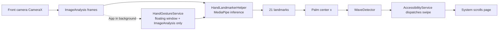

# Hand Landmarker Android — Project Overview (English)

> Human-oriented summary; AI quick context: `AI_CONTEXT_en.md` / `AI_CONTEXT_zh.md`.

## What is this project?

It started as Google MediaPipe's official Android hand-landmark demo: open the
camera and see 21 hand landmarks traced in real time, or run the same detection
on images/videos from the gallery.

On top of that, the project adds a core feature — **air-gesture control**:

- The front camera continuously detects "wave left / wave right";
- On detection, an Android AccessibilityService dispatches a system-wide
  "swipe up / swipe down";
- You can scroll pages (videos, long articles) without ever touching the screen.

This is an accessibility use case: it lets people with limited hand dexterity or
precision operate their phone hands-free.

## Features

- Real-time hand tracking: 21 landmarks + connections drawn on the front-camera feed
- Hand detection on gallery images/videos (removed — the app now focuses on gesture control)
- Air gestures: wave left → swipe down, wave right → swipe up (currently hard-coded)
- Background operation: a foreground service takes over the camera when the app
  goes to the background and keeps detecting
- Draggable floating preview window showing the background camera feed
- GPU inference by default (auto-falls back to CPU) for faster/lower-power
  detection, and a one-tap Exit button that fully stops the service and app
- Background performance mode: shared single model, 320x240 frames, dynamic
  5/15 fps (idle/hand), floating preview off by default — the app no longer
  makes other apps lag
- A "Swipe Control" master switch (default ON) to disable phone operation
  without killing detection, and an adjustable "Swipe Interval" (0.5-3s,
  default 1s) that ignores new detections right after a swipe to prevent the
  hand-return from triggering a reverse swipe
- Tweakable inference settings (num hands, confidence thresholds — stock feature)

## Architecture at a glance

In one sentence: **camera frames → MediaPipe finds the hand → wave direction is
decided → the accessibility service swipes the screen for you.**

## Key components

| Component | Purpose | Status |
| --- | --- | --- |
| `MainActivity` | App entry; hands camera ownership between foreground/background | Customized |
| `CameraFragment` | Foreground camera preview + real-time detection | Customized (rebind) |
| `HandLandmarkerHelper` | MediaPipe inference wrapper; outputs 21 landmarks | Customized (wave hook) |
| `WaveDetector` | Wave-direction algorithm (sliding window + speed) | New |
| `HandGestureService` | Background foreground service + floating preview | New |
| `GestureAccessibilityService` | Accessibility service dispatching swipe up/down | New |
| `OverlayView` | Draws the landmark skeleton on preview | Stock |

## How to run

1. Open the `android/` directory in Android Studio
2. Connect a physical device with developer mode (camera required; no emulator)
3. Hit Run; the first build auto-downloads `hand_landmarker.task`
4. Grant camera, overlay, and notification permissions; enable the app under
   system "Accessibility" settings
5. Return to the app and wave left/right in front of the camera to test

Command line: `./gradlew assembleDebug`

Command-line builds require JDK 17; the JDK 25 bundled with the current Android
Studio cannot compile the project's Kotlin 1.7.10 toolchain (switch the Gradle
JDK to 17 in Android Studio settings).

## Current status

- A minimal working loop exists: detect → wave direction → system swipe
- Camera handover between foreground/background is clean (fragment owns
  foreground, service owns background, never competing)
- Still in development: hard-coded thresholds/coordinates, no tests for the
  gesture algorithm, accessibility/Play compliance not addressed

## Roadmap (summary)

- **Near term**: algorithm robustness (unit tests, screen-adaptive coordinates,
  adjustable sensitivity)
- **Mid term**: more gestures (fist/open palm/pinch), configurable action mapping,
  performance and power optimization
- **Later**: standalone gesture module, settings UI + onboarding, privacy and
  accessibility compliance, production release

Full roadmap: `ARCHITECTURE_AND_ROADMAP.md` at the repository root.
