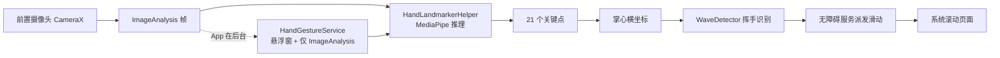

# Hand Landmarker Android 项目简介（中文）

> 面向人的概述；AI 快速上下文见 `AI_CONTEXT_zh.md` / `AI_CONTEXT_en.md`。

## 这个项目是做什么的？

它原本是 Google MediaPipe 官方提供的 Android 手部关键点检测示例：打开摄像头就能
实时看到手上 21 个关键点连成的骨架，也能对相册里的图片和视频做同样检测。

在这个基础上，项目新增了一个核心能力——**隔空手势控制**：

- 用前置摄像头持续识别"向左挥手 / 向右挥手"；
- 识别成功后，通过 Android 无障碍服务向系统派发"上滑 / 下滑"手势；
- 于是不用触摸屏幕，挥挥手就能滚动页面（刷视频、看长文等）。

这是一个典型的**无障碍辅助场景**：让手部不便、无法精确触屏的人，也能操作手机。

## 主要功能

- 实时手部检测：前置摄像头画面中标记 21 个关键点与连线
- 相册图片 / 视频的手部检测（已移除，应用聚焦隔空手势控制）
- 隔空手势：左挥→下滑，右挥→上滑（当前映射写死，后续可配置）
- 后台运行：App 退到后台后由前台服务接管摄像头，继续识别
- 悬浮窗：后台运行时显示一个小预览窗，可拖动位置，方便确认画面
- 默认 GPU 推理（不支持时自动回退 CPU），更快且更省电
- 参数面板一键"退出"：停掉后台服务并完全关闭应用，返回键同样生效
- 后台性能模式：共享单模型、320×240 低分辨率、动态 5/15fps（无手/有手）、
  悬浮窗默认关闭——不再拖慢抖音/小说等前台应用
- "滑动操作"总开关（默认开）：关闭后不再操作手机，但检测继续运行
- "滑动间隔"可调（0.5~3 秒，默认 1 秒）：滑动后该时间内忽略新检测，
  防止挥手后收手回滑触发反向滑动
- 参数可调：官方示例自带的手数、置信度等推理参数设置

## 整体架构

一句话概括：**摄像头取帧 → MediaPipe 找手 → 判断挥手方向 → 无障碍服务替你滑动屏幕**。

## 关键组件

| 组件 | 作用 | 状态 |
| --- | --- | --- |
| `MainActivity` | 应用入口；App 前后台切换时协调摄像头归属 | 已定制 |
| `CameraFragment` | 前台相机预览 + 实时检测 | 已定制（重绑摄像头） |
| `HandLandmarkerHelper` | MediaPipe 推理封装，输出 21 个关键点 | 已定制（接入挥手识别） |
| `WaveDetector` | 挥手方向算法（滑动窗口 + 速度阈值） | 新增 |
| `HandGestureService` | 后台前台服务 + 悬浮窗预览 | 新增 |
| `GestureAccessibilityService` | 无障碍服务，向系统派发上滑/下滑 | 新增 |
| `OverlayView` | 在预览上绘制关键点骨架 | 官方原有 |

## 如何运行

1. 用 Android Studio 打开 `android/` 目录
2. 连接开启开发者模式的真机（需摄像头；模拟器不可用）
3. 点 Run；首次构建会自动下载模型文件 `hand_landmarker.task`
4. 按提示授予摄像头、悬浮窗、通知权限，并在系统"无障碍"设置中开启本应用
5. 返回应用，举起手在摄像头前左右挥动即可测试

命令行构建：`./gradlew assembleDebug`

命令行构建需要 JDK 17（当前 Android Studio 自带的 JDK 25 无法编译项目的
Kotlin 1.7.10 工具链，需在设置中将 Gradle JDK 切到 17）。

## 当前状态

- 已完成"识别 → 挥手方向 → 系统滑动"的最小可用闭环
- 前后台摄像头切换思路清晰：前台归 Fragment，后台归服务，互不抢占
- 属于开发阶段：阈值与坐标硬编码、缺乏测试、无障碍上架合规未处理

## 后续规划（摘要）

- **近期**：算法鲁棒性（单元测试、屏幕自适应坐标、可调灵敏度）
- **中期**：更多手势（握拳/五指/捏合）、可配置动作映射、性能与功耗优化
- **后期**：独立手势算法模块、设置页与引导、隐私与无障碍合规、正式发布

完整规划见仓库根目录 `ARCHITECTURE_AND_ROADMAP.md`。
